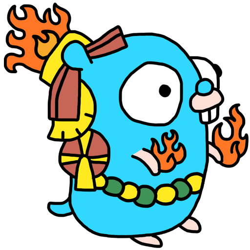

# Chantico - energy controller





## Description

In Aztec religion, [Chantico](https://en.wikipedia.org/wiki/Chantico) is the 
deity who reigns over the fires of hearths and fire stoves. If you would 
substitute hearths with datacenter bare metals, Chantico would have similar 
ruling power over the energy flowing through the data center resources in our 
context. Chantico is a [K8s SDK operator](https://sdk.operatorframework.io) 
project handling the monitoring of power usage of devices, such as PDUs and 
bare metal servers monitored with SNMP but we also envision monitoring VMs 
running on hypervisors and pods in clusters.

## Getting Started

How-to guides can be found in the `/docs` folder and on our [documentation 
website](https://chantico-300062.ci.tno.nl/).

For a quick start, install Chantico on your k8s cluster using:

```bash
helm install chantico oci://ghcr.io/tno-misd/charts/chantico -n chantico # Latest version
```

For more information have a look at the following [installation guide](docs/how-tos/how-to-install-chantico.md). For a local setup of Chantico, please have a look at the following [guide](docs/how-tos/how-to-setup-the-local-development-environment.md).

### Prerequisites

- go version v1.24.13+
- docker version 17.03+.

If not using local development using kind:
- kubectl version v1.11.3+.
- Access to a Kubernetes v1.11.3+ cluster.

## Contributing

We welcome issues and discussions for our project. Initially, we will not seek 
external contributions via Pull Requests. At this stage in the project it is 
considered too early to accept external work, given pending design changes and 
major technology choices. Once we are more mature, we welcome contributions 
that align with our scope and vision of the Chantico project. Have a look at 
our [contribution 
guidance](https://github.com/TNO-MISD/.github/blob/main/CONTRIBUTING.md).

## Code of Conduct

Please consider the guidelines in the [Code of 
Conduct](https://github.com/TNO-MISD/.github/blob/main/CODE_OF_CONDUCT.md) when 
participating in our shared environment.

## License

Copyright 2025-2026 TNO.

Licensed under the Apache License, Version 2.0 (the "License");
you may not use this file except in compliance with the License.
You may obtain a copy of the License at

    http://www.apache.org/licenses/LICENSE-2.0

Unless required by applicable law or agreed to in writing, software
distributed under the License is distributed on an "AS IS" BASIS,
WITHOUT WARRANTIES OR CONDITIONS OF ANY KIND, either express or implied.
See the License for the specific language governing permissions and
limitations under the License.

