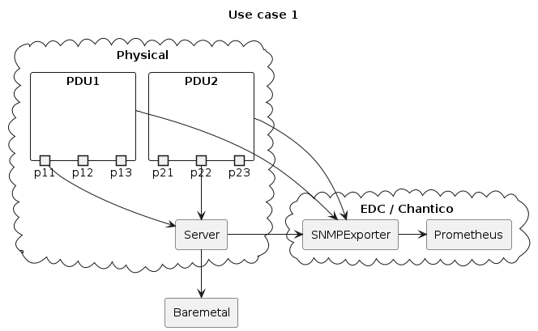
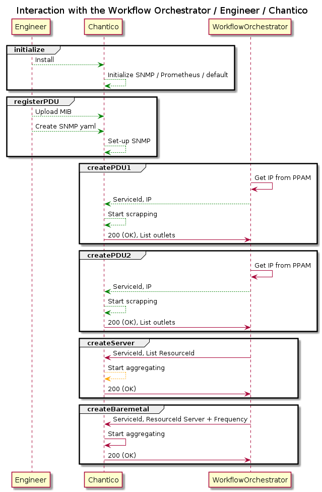
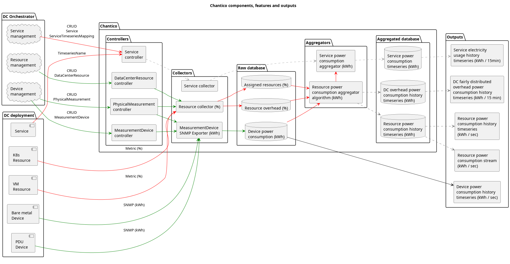

## First use-case

### Use case

The first considered use case of chantico is a server plugged on two PDU outlets from two different PDUs with a baremetal offering (with IPMI interface access to the consumer).

### Sequence diagram

The sequence diagram are the interactions between chantico, the workflow orchestrator and the engineer.

### Architecture

The components, features and outputs of chantico related to the first use case and later uses cases as context are demonstrated in the following flow diagram.

